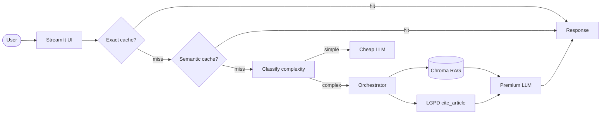

# Disciplina: **Desenvolvendo Software com IA Generativa**

# Autores: 
### - Filipe Alves de Sousa; 
### - Bruno Matsuyama.

# Assistente LGPD com RAG e tool de citação

Assistente técnico em português para responder perguntas sobre a LGPD com base em corpus local, citação de artigos e cache para reduzir custo e latência.


**Live demo:** pronta para deploy no Streamlit Cloud

Link vídeo no Youtube: [](https://youtu.be/ImcrGssK8iY)


## My Aplication 
   
 
 _Testando a aplicação do assistente LGPD com RAG e tool de citação_  
 

## Problem statement

O projeto responde perguntas práticas sobre proteção de dados pessoais, especialmente para quem precisa entender obrigações, direitos do titular e fundamentos legais sem ler a lei inteira manualmente. A combinação de LLM + RAG + tool-use funciona melhor do que busca simples porque recupera o artigo certo, mantém o contexto ancorado e ainda permite uma citação determinística por artigo quando o usuário pede precisão jurídica.

## Arquitetura



Arquitetura ajustada para a modalidade A com corpus próprio em LGPD e uma tool específica para citação de artigos.

## Setup

```bash
# 1. Dependencias
uv sync

# 2. API key
copy .env.example .env
# edite o arquivo .env com GROQ_API_KEY para chat e, se quiser, ajuste EMBED_PROVIDER

# 3. Corpus
# O projeto usa data/corpus/lgpd.md como base e tambem aceita PDFs, TXT e MD adicionais.

# 4. Rodar local
uv run streamlit run src/ui/streamlit_app.py
```

## Deploy

Para o Streamlit Cloud, conecte o repositório, selecione `src/ui/streamlit_app.py` como entrypoint e configure os segredos do app com `GROQ_API_KEY`. Se quiser embeddings remotos, adicione também a chave escolhida e altere `EMBED_PROVIDER`.

## Benchmark

O script `scripts/benchmark.py` mede latência fim a fim, hit-rate de cache e distribuição de routing. Rode depois de configurar a chave e o corpus:

```bash
uv run python scripts/benchmark.py
```

No ultimo run local, com 7 queries, o resultado foi:

- 1 hit em exact cache
- 0 hits em semantic cache
- 5 queries simples roteadas para o caminho barato
- 1 query complexa roteada para o caminho premium
- latencia media de 593.62 ms
- P95 de 1438.86 ms

## Cost & Latency

Os custos abaixo usam numero de chamadas premium como proxy de custo, porque o benchmark local mede latencia e mix de rotas, nao a fatura do provedor.

| Estrategia | Custo total | Reducao | P95 latency |
|---|---:|---:|---:|
| Baseline (premium sempre) | 7 chamadas premium | — | 1438.86 ms |
| + Exact cache | 6 chamadas premium | 14.29% | 1438.86 ms |
| + Semantic cache | 6 chamadas premium | 14.29% | 1438.86 ms |
| + Routing cheap-first | 1 chamada premium + 5 baratas | 85.71% | 1438.86 ms |

Meta da rubrica: reduzir custo com cache e routing e documentar P95 apos um bench real.

## Design decisions

- Corpus em LGPD: o escopo fica claro, juridico e facil de demonstrar em entrevista.
- Tool `cite_article`: torna a citacao deterministica e reduz o risco de alucinacao em artigos.
- Chunking em 800/100: equilibra contexto suficiente com granularidade para recuperar artigos relevantes.
- Cache semanticamente semelhante: economiza chamadas repetidas quando o usuario pergunta a mesma ideia com outra formulação.
- Routing cheap-first: perguntas simples tendem a ficar no modelo barato, reservando o premium para casos mais complexos.

## Limitations

- O corpus principal foi curado em Markdown para a demo; ele precisa ser mantido manualmente se a lei for atualizada.
- A tool cobre artigos escolhidos do corpus e nao substitui uma base juridica completa com atualização automatica.
- A qualidade final da resposta ainda depende da chave de API e do modelo configurado no `.env`.

## Tech stack

- **LLM:** Groq llama-3.3-70b-versatile (default) / Gemini / GPT-4o-mini (fallback)
- **Embeddings:** local `all-MiniLM-L6-v2` por padrao, com opcao remota via Gemini/OpenAI
- **Vector store:** Chroma local
- **UI:** Streamlit
- **Observability:** structured logs com trace_id (Langfuse opcional)
- **Deploy:** Streamlit Community Cloud

## Estrutura

```
template-portfolio/
├── data/
│   ├── corpus/           # corpus LGPD em Markdown e arquivos adicionais
│   └── chroma/           # vector store (gitignored)
├── src/
│   ├── ui/streamlit_app.py
│   ├── pipeline/
│   │   ├── rag.py        # ingestao, retrieval e resposta
│   │   ├── tools.py      # cite_article
│   │   ├── cache.py      # exact + semantic cache
│   │   └── routing.py    # cheap-first routing
│   └── observability/trace.py
├── tests/test_smoke.py
├── pyproject.toml
└── README.md             # voce esta aqui
```

## Fluxo principal

1. Usuário envia uma pergunta na UI.
2. O sistema tenta exact cache e semantic cache.
3. Se houver miss, o routing decide se a pergunta é simples ou complexa.
4. O RAG recupera trechos relevantes do corpus LGPD.
5. A resposta final é gerada com contexto ancorado e fontes citadas.
6. Quando necessário, a tool `cite_article` devolve o artigo em formato determinístico.

## Decisões de design

- Corpus em Markdown para reduzir atrito na entrega e permitir testar sem depender de PDF escaneado.
- Tool focada em artigo de lei porque este domínio pede citação precisa e não apenas resumo.
- Observabilidade simples com `trace_id` porque é suficiente para demonstrar o fluxo e a latência.
- Cache e routing separados para tornar o custo visível e fácil de explicar na apresentação.

## Limitações

- Ainda não há benchmark numérico preenchido com custo e P95; isso deve ser medido em execução real.
- O corpus é intencionalmente controlado e não aceita upload livre de documentos pelo usuário.
- A tool cobre os artigos incluídos no Markdown local; ampliar o corpus exige manutenção manual.

## Checklist de entrega

- Deploy público funcionando.
- Repositório público com README preenchido.
- Vídeo demo curto mostrando pergunta, cache e tool de citação.
- Corpus LGPD carregando localmente.
- Testes unitários passando.

---

*Projeto alinhado com a Modalidade A do Day-3, usando corpus próprio em LGPD.*
